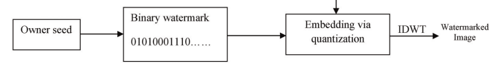

# The Robustness of Watermark Embeddedness Based on Different Transformations with Different Algorithms into Different Frequency

## Abstract

In this essay, the blind watermark based on wavelet transformation with quantized algorithm embedded into high frequency will be set as a reference. By changing the transformation method(Fourier transformation or Wavelet transformation) the watermark bases on, the algorithm method (Additive or Quantized) the watermark uses and the frequency(High or Low) the watermark is inserted into respectively, we embed these sorts of watermarks into the same picture and check their robustness respectively. Thus, we acquire a sort of watermark among them with the best robustness and acceptable invisibility. To test their robustness,  the pictures with the information of the watermarks will be rotated, cropped, blurred, sharpened,compressed and added salt and pepper. Whether we can still detect the watermarks' information after the process is the index of corresponding robustness.

## Key word

Blind watermark, wavelet transform, Fourier transform, robustness, quantization algorithm, additive algorithm

## Introduce

Watermark is usually used to identify the source of some image or claim the copyright of it. In this essay, we are talking about the blind watermark. In some unprofessional blogs, the blind watermark is confused with the watermark with good invisibility. Actually, the so-called blind watermark is referred that the original picture is not necessary to extract the watermark from the embedded picture. A kind of method that the blind watermark is embedded into the high-frequency band of the 3-level wavelet transform by quantized algorithm  is recommended by an authoritative essay[^1]. So, here, we will explore the robustness of similar methods based on it by changing one factor at a time. In other words, the method that the blind watermark is embedded into low-frequency band of 3-level wavelet transform by quantized algorithm, the method that the blind watermark is embedded into high-frequency band of Fourier transform by quantize algorithm and the method that the blind watermark is embedded into high-frequency band of 3-level wavelet transform by additive algorithm are involved into this report. To compare their robustness, the attacks including blurring, sharpening, cropping, rotating, compressing, salt and pepper noise are imposed. The degree of the watermark degeneration will be recorded as according.

## Method

### Transform

#### 3-level wavelet transform

Specifically,  3-level 2D discrete wavelet transform with Daubechies-8 filters is adopted.

```python
import pywt

imageAftWav=pywt.wavedec2(image,"db4",mode="periodization",level=3,axes=(-2, -1))
```

After transform, different frequency bands are distributed as followed:


In wavelet transform, LL3 is used as low-frequency band and HL3 is used as high-frequency band to embed the watermark.

```python
ll3=imageAftWav2[0]
hl3=imageAftWav2[1][0]
```

#### Fourier transform

```python
import cv2

imageAftDft=cv2.dft(np.float32(image), flags = cv2.DFT_REAL_OUTPUT)
```

The low-frequency band is not shifted to the center, so I only need to gain the middle square to get the high-frequency band.

### Algorithm

#### Quantized algorithm

##### Embedding

1. The watermark is generated as random Boolean values whose size is the same as the embedded band(in my program:40*40) by a certain seed[^2].

2. The coefficients in the embedded band which have magnitude*(the absolute value)* higher than t1 and lower than t2 are chosen to hide in. A threshold t = α$\lvert C \rvert_{max}$ is selected

   *0.01< α<0.1 and t2>t1>t* 

3. The quantization process is done as shown

   If $w_{ij}=true$ and $c_{ij}>0$, then $c'_{ij}=t2-X1$

   If $w_{ij}=false$ and $c_{ij}>0$, then $c'_{ij}=t1+X1$

   If $w_{ij}=true$ and $c_{ij}<0$, then $c'_{ij}=-t2+X1$

   If $w_{ij}=false$ and $c_{ij}<0$, then $c'_{ij}=-t1-X1$

   $c_{ij}$ is the coefficient satisfying the condition. $w_{ij}$ is the watermark value at the corresponding position. $c'_{ij}$ is the coefficient after quantization.  X1 narrows the range between the two quantization levels t1 and t2 in order to perform a robust oblivious detection

4. After all the selected coefficients are quantized, the inverse discrete wavelet transform (IDWT) is applied, and the watermarked image is obtained.




```python
import numpy as np

def embedWatQuan(matrix,t1,t2):
    X1=t2/10
    wat=np.random.choice(a=[False,True],size=1600)
    for i in range(40):
        for j in range(40):
            if (matrix[i][j]>t1 and matrix[i][j]<t2) and wat[40*i+j]==True:
                matrix[i][j]=t2-X1
            elif (matrix[i][j]>t1 and matrix[i][j]<t2) and wat[40*i+j]==False:
                matrix[i][j]=t1+X1
            elif (matrix[i][j]<-t1 and matrix[i][j]>-t2) and wat[40*i+j]==True:
                matrix[i][j]=-t2+X1
            elif (matrix[i][j]<-t1 and matrix[i][j]>-t2) and wat[40*i+j]==False:
                matrix[i][j]=-t1-X1 
    return wat
```

In my program, X1 is selected as t2/10.

##### Detection

1. All the wavelet coefficients of magnitude higher than or equal to t1 + X2 and less than or equal to t2 - X2 are chosen, which are named $w_{ij}^{'s}$. Note that the value of X2 should be lower than the value of X1. This maintains that all the marked coefficients are recovered and dequantized after being attacked.

2. The extraction of watermark bits from the selected wavelet coefficients is done as below

   If $w_{ij}^{'s}<(t1+t2)/2$, $w'_{ij}$ is *false*

   If $w_{ij}^{'s}\geq(t1+t2)/2$, $w'_{ij}$ is true

   $w'_{ij}$ is the watermark detected at the corresponding position.

   

3. Then the correlation process is applied between the recovered watermark and the original watermark, obtained via the secret key, just only in the locations of the selected coefficients

   ```python
   import difflib
   
   def detectWatQuan(wat_embedded,matrix,t1,t2):
       X2=t2/20
       watLen=0
       for i in range(40):
           for j in range(40):
               if abs(matrix[i][j])>=t1+X2 and abs(matrix[i][j])<=t2-X2:
                   watLen+=1
       wat_detected=np.empty(watLen,dtype=bool)
       wat_correlated=np.empty(watLen,dtype=bool)
       watNo=0
       for i in range(40):
           for j in range(40):
               if abs(matrix[i][j])>=t1+X2 and abs(matrix[i][j])<=t2-X2:
                   if abs(matrix[i][j])<(t1+t2)/2:
                       wat_detected[watNo]=False                    
                   elif abs(matrix[i][j])>(t1+t2)/2:
                       wat_detected[watNo]=True
                   wat_correlated[watNo]=wat_embedded[40*i+j]  
                   watNo+=1                  
                   
       return difflib.SequenceMatcher(None,wat_correlated,wat_detected).quick_ratio()
   ```

   In my program, X1 is selected as t2/10. And the correlation is acquired by using `difflib.SequenceMatcher`

#### Additive algorithm(Dugad’s method)

##### Embedding

1. From all wavelet coefficients, the coefficients of magnitude higher than t1 are chosen. This proves that only significant coefficients are used.

2. Then the zero mean and unit variance watermark are generated with a known seed value; the watermark should be equal in size to the input image(in my program:40*40)

3. The watermark is embedded in each location which has wavelet coefficient with magnitude higher than t1; the watermarked wavelet coefficient is given:

   

   where $w_{ij}$is the wavelet coefficient, k is a scaling parameter, $x_{ij}$ is a watermark value, and $\hat w_{ij}$is the watermarked wavelet coefficient.

   ```python
   import numpy as np
   
   def embedWatAddi(matrix,t1):
       k=0.175
       wat=np.random.randn(1600)
       watNo=0
       for i in range(40):
           for j in range(40):
               if matrix[i][j]>t1 or matrix[i][j]<-t1:
                   matrix[i][j]+=abs(matrix[i][j])*k*wat[40*i+j]
       return wat
   ```

   k is selected as 0.175 to ensure the invisibility of watermark after embedding.`wat=np.random.randn(1600)` is used to generate watermark sequence in accordance with normal distribution.

##### Detection

1. All wavelet coefficients of magnitude greater than t2 from a possibly corrupted watermarked image are selected. Note that by setting t2 > t1, the robustness is increased.

2. Wavelet coefficients with magnitude higher than t2 are used in the detection process; these detected values are correlated with the watermark values at the same locations.

3. The correlation δ is estimated by correlating the watermark sequence w directly with all N coefficients of the embedded image V*

   

   Usually, a detection threshold τ is established to make the detection decision if δ τ, where only the coefficients above the detection threshold are considered.

   But here, we only need to verify the robustness of the watermark instead of ensuring whether the watermark exist or not, so there is no need to set the threshold.

   ```python
   def detectWatAddi(wat_embedded,matrix,t2):
       correlation=0
       N=0
       for i in range(40):
           for j in range(40):
               if abs(matrix[i][j])>t2:
                   correlation+=matrix[i][j]*wat_embedded[40*i+j]
                   N+=1
       corr=correlation/N
       return corr
   ```

### Attack

1. Blurring: Gaussian Blur
2. Sharpening: Laplacian Sharpen
3. Rotate: Rotate $\frac{\pi}{2}$
4. Crop: Crop the 320 *320 image to 200 *200
5. Compress: JPEG compression with quality 50
6. Salt and Pepper: the SNR is 0.95

## Results

### Measurement Method


### Data Recording

| Water Embedding method | Base Ratio |      | Gaussian Blur | Laplacian sharpen | rotated Pi/2 | Crop  | compressed with quality of 5 | salt and pepper with snr of 0.8 | before embed |
| ---------------------- | ---------- | ---- | ------------- | ----------------- | ------------ | ----- | ---------------------------- | ------------------------------- | ------------ |
| Reference              | 0.963      |      | 0.433         | 0.151             | 0.105        | 0.567 | 0.995                        | 0.527                           | 0.463        |
| Low Frequency          | 0.963      |      | 0.985         | 0                 | 0.103        | 0.554 | 0.995                        | 0.849                           | 0.319        |
|                        |            |      |               |                   |              |       |                              |                                 |              |

$\alpha_1=115/558=0.206$

$\alpha_2=200/558=0.358$

## References and Note

[^1]:Abeer D. Algarni and Hanaa A. Abdallah. Blind Wavelet-Based Image Watermarking
[^2]:The seeds of the random numbers used to generate the watermark in the report are all 261025
